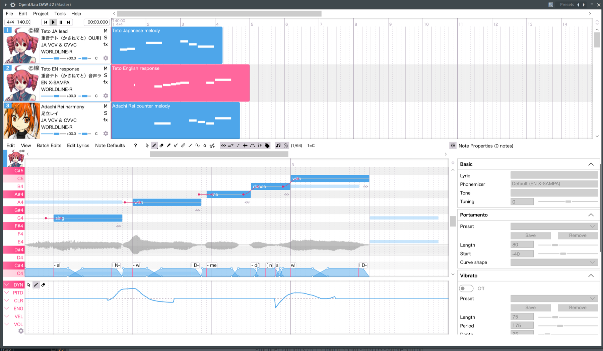

# OpenUtau DAW (VST3)

OpenUtau DAW hosts the full OpenUtau singing editor inside a resizable VST3
instrument. The first verified host is FL Studio 2026 on Apple-silicon macOS.
The interaction model follows Synthesizer V's instrument plug-in: notes,
lyrics, singers, and pitch are edited in OpenUtau while the DAW owns transport,
tempo, project save, audio routing, mixer effects, and export.



_The real FL Studio acceptance project on the target Mac: three singer tracks,
Japanese and English phonemizers, rendered waveforms, and detailed pitch and
phoneme editing in the embedded OpenUtau workspace._

This repository is preparing an AGPLv3 open-source alpha, not yet a signed and
notarized public binary release. The
current implementation and its remaining release gates are recorded in
[docs/architecture.md](docs/architecture.md) and
[docs/verification.md](docs/verification.md). The concrete release handoff is
tracked in [docs/release-checklist.md](docs/release-checklist.md).
The signed/notarized draft-release workflow and required repository secrets are
documented in [docs/github-release.md](docs/github-release.md).
Installation instructions are in
[docs/install-macos.md](docs/install-macos.md).

## Current behavior

- FL Studio discovers **OpenUtau DAW** as a stereo VST3 generator.
- The complete OpenUtau workspace is embedded in the FL plug-in window; no
  second desktop editor is required.
- FL play position, play/stop state, BPM, and time signature update the editor.
- Plain Space (stop/rewind) and Command+Space on macOS (pause/resume; the
  Control+Space spelling is also accepted) are passed to FL Studio. Stopping
  keeps the OpenUtau editing viewport in place. Other
  Command/Control editor shortcuts, including Undo/Redo and Open, remain inside
  OpenUtau.
- OpenUtau preview audio leaves through the VST output and FL mixer. It never
  opens a competing hardware audio device.
- The complete USTX payload is stored in the VST state chunk when the DAW
  project is saved. **Export USTX Copy…** is optional interchange/backup, not a
  prerequisite for saving an FLP.
- Multiple plug-in instances render and store state independently. Because
  upstream OpenUtau's editor model is process-global, only one full editor can
  be visible at a time; close one instance's editor before opening another.
- The separately installed OpenUtau desktop app can run alongside FL Studio
  and the VST3. It is a different process and is not subject to the VST
  editor-window lease.
- Notes are authored in the embedded OpenUtau editor. The VST3 deliberately
  does not advertise or capture DAW MIDI input.

## Support status

| Platform / host | Status |
| --- | --- |
| macOS arm64 + FL Studio 2026 | Public-alpha candidate exercised on the target Mac; signing/notarization pending |
| Windows x64 + FL Studio | Build/validator lane defined; licensed-host evidence still required |
| Other VST3 DAWs | Expected to use the standard VST3 contract, but not yet acceptance-tested |
| Intel macOS | Not built or tested |

## Container-first development

The supported development and regression entry point is Docker Compose:

```sh
docker compose build dev
docker compose run --rm dev ./scripts/ci.sh
```

The container owns the .NET SDK, C/C++ toolchain, NuGet cache, CMake downloads,
and portable test dependencies. Named Docker volumes retain caches, including
the private macOS runtime used only while assembling a package. A native
macOS VST3 must ultimately be linked and signed on macOS, so
`scripts/package-macos.sh` uses Docker for both managed publishes and a host
CMake executable only for the final Apple binary. The package carries its own
private .NET runtime; users do not install .NET, OpenUtau, or development SDKs.
Each archive is accompanied by a SHA-256 checksum and contains a verified
file-level SHA-256 manifest for the package contents.

## Repository layout

- `upstream/` — pinned OpenUtau source baseline (MIT)
- `patches/` — replayable VST adapter patch for the pinned source
- `plugin/` — native VST3, host transport, state, and real-time audio bridge
- `bridge/` — embedded managed editor, render sidecar, and versioned protocol
- `tests/` — unit, integration, loaded-VST3, singing, and host acceptance tests
- `docker/` — reproducible development environment
- `artifacts/` — local packages, fixtures, and acceptance projects

The OpenUtau baseline is pinned to
`29e0e16d1623cda79ba7c3724614d6129ba3b9d5`. CI replays
`patches/openutau-vst.patch` against a clean copy of that commit and fails if
the adapter can no longer be reproduced.

The VST adapter and combined distribution use JUCE's AGPLv3 path; upstream
OpenUtau remains MIT licensed. Public binaries must include the generated
third-party notices and exact corresponding source, plus platform
signing/notarization. See [docs/licensing.md](docs/licensing.md).
